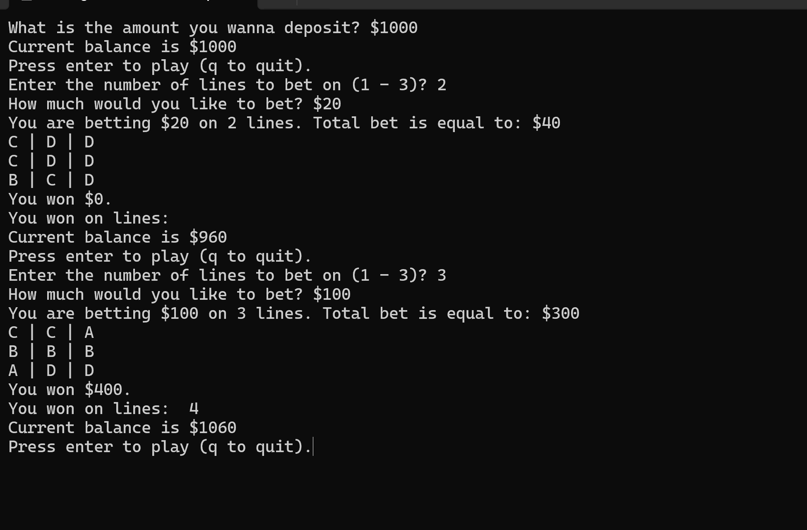
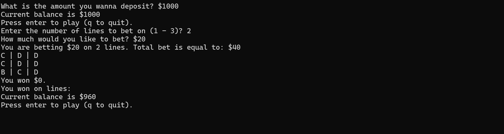

# Python Slot Machine Game

## Overview
A console-based slot machine game written in Python. Players can deposit virtual money, place bets across multiple lines, and spin the reels to win. This project demonstrates basic Python programming concepts, user input handling, and randomization logic.

## Features
- Deposit and manage a virtual balance  
- Choose the number of lines to bet on (1–3)  
- Place bets within defined minimum and maximum limits  
- Randomized slot machine spins with multiple symbols  
- Calculates winnings based on matching lines  
- Console-based interactive gameplay  

## Tech Stack
- Python 3  
- Standard library only (`random` module)  

## How to Run
1. Clone this repo:
   ```bash
   git clone <repo-url>
   
2. Navigate into repo directory
   ```cd python-slot-machine```
   
3. Run the game
   ```python slot_machine.py```
   
4. Follow on-screen prompts to deposit money, place bets, and spin the slot machine.

5. Press ```q``` to quit the game.


# Project Snapshots



# Learning / Takeaways

- Practiced using Python functions, loops, and conditional statements

- Learned to handle user input and validate data

- Implemented basic game logic and randomization

- Gained experience creating a simple interactive console application
